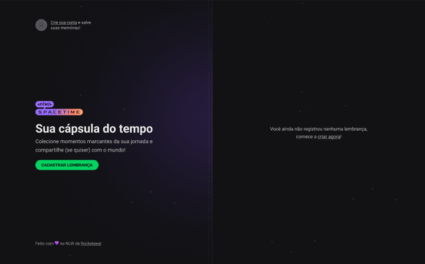

<h1 align="center"> Spacetime </h1>

O projeto é uma rede social voltada para a publicação de memórias, permitindo ao usuário fazer o upload de imagens, colocar descrição e uma data à memória que será criada.  
O projeto consome uma API que está localizada na pasta Server, que permite o Login com o Github e a listagem, criação, alteração e remoção de uma memória.

  <a href="#tecnologias">Tecnologias</a>&nbsp;&nbsp;&nbsp;|&nbsp;&nbsp;&nbsp;
  <a href="#installation">Instalação</a>&nbsp;&nbsp;&nbsp;|&nbsp;&nbsp;&nbsp;
  <a href="#layout">Layout</a>&nbsp;&nbsp;&nbsp;&nbsp;&nbsp;&nbsp;

 

  

<h1 id='tecnologias'>🖱️ Tecnologias</h2>

O projeto foi construído com as seguintes tecnologias:

### Frontend
- Typescript
- NextJS
- TailwindCSS
- Axios
- Eslint
- Lucide-React (Ícones)
- Js-Cookie (Cookies no Frontend)
- Jwt-decode (Decodificar o token do JWT)
- DayJS (Manipulação de datas)

### Backend
- Typescript
- Fastify
- Prisma
- Axios
- Zod
- Dotenv (Variáveis de ambiente)
- fs ( criação e exclusão de arquivos )
- JWT (Criação de tokens)
- Tsx (Compilação do Typescript)
- Fastify/Multipart (Upload de arquivos)
- Eslint

 

<h1 id='layout'>🖥️ Layout</h1>

 

> Para ver o projeto no Figma, use [ESTE LINK](https://www.figma.com/file/wGUavGAoMDRsLhkQtSGfm4/Cápsula-do-tempo-•-Trilha-Ignite-(Community)?type=design&node-id=0-1&t=VeWgObBVAfx3bvCE-0)

 

<h1 id='installation'>📤 Instalação</h1>

<h3>Primeiramente, você precisa <strong>clonar o projeto</strong> em sua máquina:</h3>
 

<code>git clone https://github.com/cristian-sbardelotto/nlw-spacetime</code>

 

<h3>Preencha as suas <strong>credencias do Github</strong>, como está determinado no arquivo .env.example</h3>

 

<h3>Depois disso, abra a pasta do projeto e  <strong>instale as dependências:</strong></h3>

<code>npm i</code>

<code>yarn</code>

<h3>Para <strong>rodar o projeto</strong> em seu browser, use:</h3>

<code>npm run dev</code>

<code>yarn dev</code>

 

---

<h2 align='center'>Enjoy this project!</h2>

 

Developed with ❤️ by <strong>Cristian Sbardelotto</strong>

 

